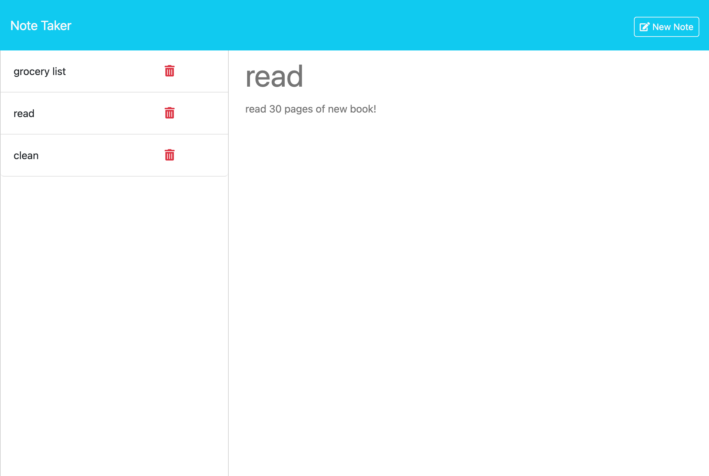

# Note Taker App

## Description

The Note Taker App was created so that the user can quickly jot down notes or reminders and access them whenever needed. In building this project, I worked with Express and gained a better understanding of backend code and how to organize it within separate files. I also learned how to create a delete request and implemented the filter method.

## Usage

The user will click into the application with the Get Started button. They can then enter a title and note on the right side of the screen. As they type, they have the option to clear the form, deleting the content they've typed so far. They can also choose to save their note. The saved notes appear as a list on the left side of the application. When the user clicks a saved note from the left, the full details of the note will appear on the right side of the screen. The user can also delete the note from the left side of the screen after it has already been saved.

## Credits

I worked with my tutor, John Titus, on how to reorganize the back end files in a way that makes more sense longterm.

## License

MIT License